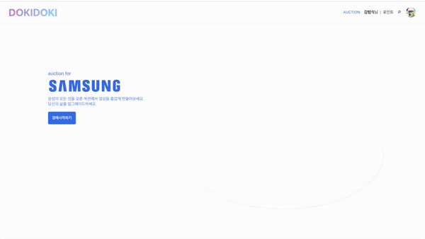

# README

Created: April 5, 2023 1:57 PM

# I. 서비스 소개

## 1. Overview

경매를 통해 중고 전자제품을 쟁취하세요! 합리적인 가격으로 구매할 수 있고, 어떤 걱정도 없이 간편하게 판매할 수 있습니다. 

## 2. 서비스 화면

### 메인페이지

- 랜딩 페이지
    
    

- 최근 30초간 가장 입찰 요청, 조회가 많은 경매 순위
    
    
    

- 역대 거래 정보 통계 분석 (가장 많이 거래된 제품, 포인트 랭킹, 총 거래 금액 등)
    
    
    

### 마이페이지

- 입찰중 및 판매중 UI

- 구매내역 및 판매내역 UI

- 알림내역

### 경매 목록 페이지

### 경매 진행 페이지

- 제품 설명

- 입찰 성공, 실패 알림

- 낙찰 알림

- 사용자별 입찰 기록 그래프

- 제품 설명 - 마크다운 및 지도 지원

# II. 서비스 아키텍처

---

## 서비스 구조

## ERD

## 기술 스택

**📍 Frontend**

- React 18.2.0
- Recoil 0.7.7
- TypeScript 4.9.5
- Stomp.js 7.0.0
- Axios 1.3.4
- mui 5.11.12
- react-query 3.39.3

**📍 DataBase**

- MySQL 8.0.32
- Redis

**📍 Infra**

- Docker version 23.0.1
- Nginx 1.18.0 (Ubuntu)
- Jenkins 2.387.1

**Backend - MSA**

**📍 Common (+ User Server)**

- Openjdk 11
- Lombok
- jjwt 0.11.2

**📍 Notification Server**

- Spring Kafka 3.1.2
- Spring Boot WebSocket
- Jackson
- RocksDB 7.10.2

**📍 Auction Server**

- Spring Boot 2.7.9
- Spring Data JPA
- Swagger 3.0.0

**📍 Streaming Server**

- Kafka Streams 3.1.2
- Spring Kafka 3.1.2
- Jackson
- RocksDB 7.10.2

**📍 Bid Server** 

- Spring Kafka 3.1.2
- Spring Boot WebSocket
- Jackson
- Redisson 3.17.7

**📍 Gateway Server**

- Spring Cloud Gateway

**📍 Data**

- Kafka 3.4.0
- Filebeat 7.17
- Elasticsearch 7.17
- Logstash 7.17
- Kibana 7.17

# III. 협업 툴

---

### 1. Git Flow

- 브랜치 전략
    - 브랜치는 아래와 같이 4가지의 형태로 관리했습니다.
        1. `main` : 최종 release 될 브랜치
        2. `develop` : 각 feature가 merge 될 브랜치
        3. `feature` : 기능 구현 브랜치. (구현이 완료되면 develop 브랜치에 merge)
        4. `fix` : 오류 및 기타 사항을 수정하기 위한 브랜치
    
    - feature 및 fix 브랜치는 뒤에 `적용할 직무` 및 `브랜치의 목표`를 명시했습니다.
        
        (e.g. Backend 로그인의 경우 feature/be/login)
        
    
- 커밋 메시지 컨벤션
    - 커밋 메시지는 적용할 직무 및 커밋 유형을 말머리에 덧붙였습니다.
        
        (e.g. `[be/fix]` NullPointerException 수정)
        
    - 커밋 유형은 아래와 같이 정했습니다.
        
        
        | 커밋 유형 | 의미 |
        | --- | --- |
        | init | 프로젝트, 파일 생성 및 초기화 |
        | feat | 새로운 기능 추가 |
        | fix | 버그 수정 |
        | docs | 문서 수정 |
        | style | 코드 formatting, 세미콜론 누락, 코드 자체의 변경이 없는 경우 |
        | refactor | 코드 리팩토링 |
        | test | 테스트 코드, 리팩토링 테스트 코드 추가 |
        | chore | 패키지 매니저 수정, 그 외 기타 수정 ex) .gitignore |
        | design | CSS 등 사용자 UI 디자인 변경 |
        | comment | 필요한 주석 추가 및 변경 |
        | rename | 파일 또는 폴더 명을 수정하거나 옮기는 작업만인 경우 |
        | remove | 파일을 삭제하는 작업만 수행한 경우 |
        | !breaking change | 커다란 API 변경의 경우 |
        | !hotfix | 급하게 치명적인 버그를 고쳐야 하는 경우 |
        | build | 배포, Docker, Jenkins등 파일 수정 및 추가 |

### 2. Jira

- Jira 컨벤션
    - 기본 단위를 Epic으로 잡고 Task 및 Story로 나누어 작성하였습니다.
    - MSA 구조에 따라 여러 서버로 나누었기 때문에 Epic은 주로 서버를 기준으로 나누었습니다.
    - 경우에 따라 Task를 sub-task로 나누어 작업했습니다.

- 협업사항 및 결과
    - 월요일 아침마다 회의를 통해 금주에 해야 할 작업을 논의해 분배하였고, 금요일 오후마다 완료된 작업사항을 공유하며 차주의 작업 분배를 개선했습니다.
    - Story Point는 세분화된 관리를 위해 가급적 2, 3을 할당하고자 하였으나 큰 단일 작업의 경우 초과 할당을 하기도 했습니다.
    - 번다운 차트를 통해 개발이 유난히 더뎠던 부분이 있다면 그 이유와 개선사항을 분석하기도 했습니다.

### 3. Notion

- 금주 공지사항 또는 이슈 공유
- 코드, Git, Jira 등 작업 툴 컨벤션 공유
- 팀원 간 유용한 팁 공유
- [API 명세](https://www.notion.so/API-e241e7e849224affb0317ba70e21b03f)
- 툴 버전 명세

# IV. 팀원

---

| 이름 | 역할 |
| --- | --- |
| 전인덕 (PM) | Data, Frontend |
| 김범식 | Frontend, UX/UI, UCC |
| 신민혜 | Backend |
| 오종석 | CI/CD, OAuth, Backend, Frontend |
| 윤재휘 | Backend, Frontend |
| 임혜진 | Backend, 기능 소개 영상 |
