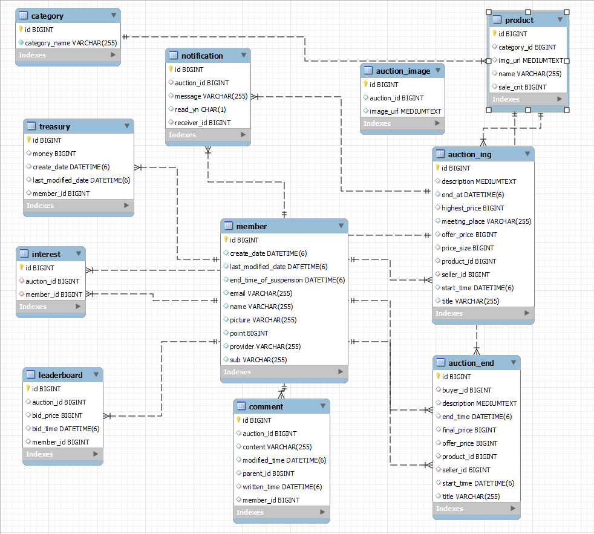

# 포팅 매뉴얼 상세

## 환경 상세

### 형상 관리

- GitLab

### 이슈 관리

- Jira

### 커뮤니케이션

- Mattermost
- Notion

### IDE

- Intellij CE 2022.3.1
- Visual Studio Code
  - vim

### Server

- AWS EC2 t5.large
  - Ubuntu 20.04
  - Docker 20.10.23.7155243

### Frontend

- React 18.2.0
  - Redux 4.2.0
  - Redux RTK 1.9.1
- TypeScript 4.9.5
- Tensorflow 3.17.0
  - tensorflow-models/posenet 2.2.2
  - tensorflow-models/pose-detection 2.0.0
- vladmandic/face-api 1.6.10
- Material UI 5.11.5
- openvidu-browser 2.25.0

### Backend

- Java OpenJDK 11
- SpringBoot Gradle 2.7.7
  - Spring Data JPA
  - Spring Security
  - Spring Cloud Gateway
  - Lombok
- OpenVidu Server 2.26.0
- Kurento Media Server 6.8.10

### Database

- MySQL (on AWS RDS)
- Redis
- InfluxDB

### Infra

- Jenkins 2.375.2
- docker-compose 2.16.0
- Envoy Proxy

## 프로젝트 구조


## SSH 연결 방법

```bash
ssh -i key_name.key ubuntu@ip
ex> ssh -i I8A207T.pem ubuntu@blahblah.movebxeax.me
```

## Docker 설치

```bash
# apt 업데이트
sudo apt-get update

# 필수 요소 설치
sudo apt-get install \
    apt-transport-https \
    ca-certificates \
    curl \
    gnupg-agent \
    software-properties-common

# docker gpg 키 설치
curl -fsSL https://download.docker.com/linux/ubuntu/gpg | sudo apt-key add -
OK

# docker 레포지토리 추가
sudo add-apt-repository \
   "deb [arch=amd64] https://download.docker.com/linux/ubuntu \
   $(lsb_release -cs) \
   stable"

# apt 업데이트
sudo apt-get update

# docker 설치
sudo apt-get install docker-ce docker-ce-cli containerd.io

# docker 실행 권한 추가
sudo usermod -aG docker ubuntu

# docker-compose 설치
sudo curl -L https://github.com/docker/compose/releases/download/v2.16.0/docker-compose-`uname -s`-`uname -m` -o /usr/local/bin/docker-compose

# docker-compose 실행권한 추가
sudo chmod +x /usr/local/bin/docker-compose
```

## 젠킨스 설치

```bash
sudo apt-get install jenkins

# 설치 이후 안내되는 내용대로 환경 설정을 진행하면 된다.
```

## 젠킨스 플러그인 설치

- Git, GitLab, NodeJS 관련 플러그인을 설치해주면 된다.

## 젠킨스 프로젝트 설정

- Git의 경우 아래와 같이 token으로 접근하는 url을 입력해주면 된다.
  
- push 혹은 merge 이벤트 발생시 자동으로 빌드를 진행하기 위해서는 아래와 같이 설정한다.
  

```bash
# 빌드 스크립트는 아래의 것을 사용한다

docker image prune -f
docker-compose build --parallel
docker-compose up -d
```

## 전체 빌드 방법

```bash
# one-shot 빌드를 제공하므로 개별 이미지를 따로 테스트하는 목적이 아닐 경우 전체 빌드를 권장한다.
# 빌드 스크립트는 Git Repository를 clone한 폴더에서 아래의 명령어를 입력한다

docker image prune -f
docker-compose build --parallel
docker-compose up -d
```

## 개별 이미지 빌드 방법

### Frontend

```bash
# 프론트엔드 빌드만 별도로 수행하기 위해서는 아래와 같이 입력한다

docker-compose build blahblah_frontend
docker-compose up -d blahblah_frontend
```

### Backend(WebServer)

```bash
# 백엔드 빌드만 별도로 수행하기 위해서는 아래와 같이 입력한다

docker-compose build blahblah_webserver
docker-compose up -d blahblah_webserver
```

### Backend(RTCServer)

```bash
# OpenVidu 서버를 래핑해주는 RTCServer 빌드만 별도로 수행하기 위해서는 아래와 같이 입력한다

docker-compose build blahblah_rtc_server
docker-compose up -d blahblah_rtc_server
```

### Backend(API Gateway)

```bash
# API Gateway 서버 빌드만 별도로 수행하기 위해서는 아래와 같이 입력한다

docker-compose build blahblah_api_gateway
docker-compose up -d blahblah_api_gateway
```

## 사용 포트 목록

- 80, 443 : http
- 3030 : Frontend
- 3478, 5349 : OpenVidu coturn
- 6379 : Redis
- 8080 : API Gateway
- 8081 : Backend
- 8086 : InfluxDB
- 9901 : Envoy-proxy admin 페이지
- 33332 : OpenVidu Wrapping API 서버

## MySQL ERD



