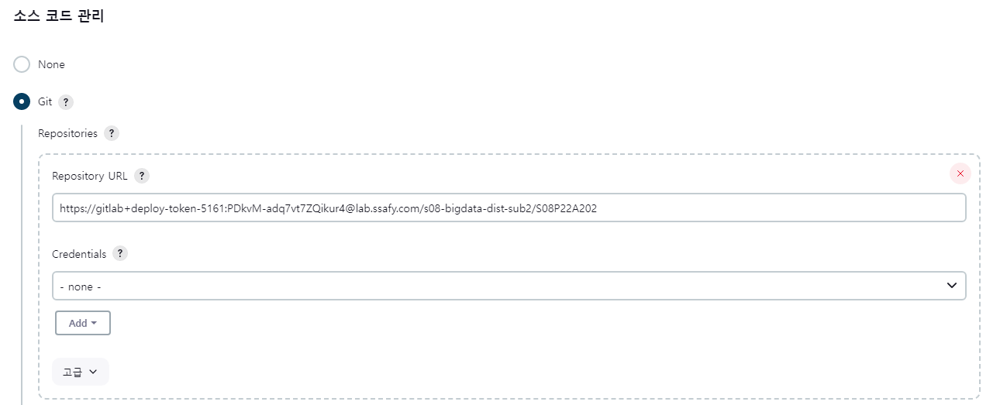

# 포팅 매뉴얼 상세

## 환경 상세

### 형상 관리

- GitLab

### 이슈 관리

- Jira

### 커뮤니케이션

- Mattermost
- Notion

### 디자인
- Figma

### UCC
- Movavi
- Adobe After Effects
### IDE

- Intellij CE 2022.3
- Visual Studio Code
- vi

### Server

- AWS EC2
  - Ubuntu 20.04 LTS
  - Docker 23.0.1
- AWS S3

### Frontend

- React 18.2.0
  - recoil 0.7.7
- TypeScript 4.9.5
- Material UI 5.11.12
- @stomp/stompjs 7.0.0
- chart.js 4.2.1

### Backend

- Java OpenJDK 11
- SpringBoot Gradle 2.7.9
  - Spring Data JPA
  - Spring Cloud Gateway
  - Lombok
- Kafka 3.4.0
- Elasticsearch 7.17
- Logstash 7.17
- Filebeat 7.17
- Kibana 7.17

### 외부 서비스
- Google Oauth
- KaKao Oauth
- KaKao Map

### Database

- MySQL 8.0.32
- Redis 

### Infra

- Jenkins 2.387.1
- docker-compose 2.16.0
- Nginx

## 프로젝트 구조


# 빌드
- /frontend/.env
  ``` bash
  REACT_APP_AUCTION_SERVER_BASE_URL = # 옥션 서버 API 요청 URL
  REACT_APP_BID_SERVER_BASE_URL = # 경매 서버 API 요청 URL
  REACT_APP_USER_SERVER_BASE_URL = # 사용자 서버 API 요청 URL
  REACT_APP_NOTICE_SERVER_BASE_URL = # 알림 서버 API 요청 URL
  ```
- .env (root directory)
  ```bash
    # docker compose로 빌드하면 root directory의
    # .env file을 수정해서 설정을 주입받을 수 있음.
    # 입력을 ""로 묶으면 안됨.

    # jwt
    JWT_ISSUER= # JWT 토큰 공급 도메인
    JWT_SECRET_KEY= # JWT 시크릿 키 
    JWT_ACCESS_EXPIRATION= # ACCESS TOKEN 만료 시간
    JWT_REFRESH_EXPIRATION= # REFRESH TOKEN 만료 시간

    # s3
    S3_BUCKET= # S3 BUCKET 명
    S3_ACCESS_KEY= # S3 KEY
    S3_SECRET_KEY= # S3 SECRET KEY

    # oauth
    GOOGLE_OAUTH_CLIENT_ID= # GOOGLE OAUTH CLIENT ID
    GOOGLE_OAUTH_CLIENT_SECRET= # GOOGLE OAUTH CLIENT SECRET KEY
    KAKAO_OAUTH_CLIENT_ID= # KAKAO OAUTH CLIENT ID
    KAKAO_OAUTH_CLIENT_SECRET= # KAKAO OAUTH CLIENT SECRET KEY

    # kafka
    KAFKA_SERVER_URI= # KAFKA 서버 주소

    # db

    # docker virtual ip
    DATABASE_URL= # mysql 서버 주소
    DATABASE_USERNAME= # mysql user name
    DATABASE_PASSWORD= # mysql user password
  ```
- /backend/api-gateway/src/main/resources/application.yml
  - docker compose를 사용하면 수정할 내용 없음.
  - virtual domain으로 routing
- /backend/bid/src/main/resources/redisson.yaml
  ```yaml
    singleServerConfig:
      idleConnectionTimeout: 10000
      connectTimeout: 10000
      timeout: 3000
      retryAttempts: 3
      retryInterval: 1500
      password: "REDIS 비밀번호"
    #  password: null
      subscriptionsPerConnection: 5
      clientName: null
      address: "redis://도메인:6379"
      # docker compose를 쓴다면 내부 6379 포트
      # 아니라면 동작 중인 서버 및 포트 기입
  ```
- /backend/auction/src/main/resources/application.yml
  ```bash
    # docker compose를 사용한다면 변경하지 않아도 된다.
    # server의 uri를 기입한다.
    api:
      server:
        uri:
          notice: # notice server uri
          bid: # bid server uri
  ```
- /backend/bid/src/main/resources/application.yml
  ``` bash
    # docker compose를 사용한다면 변경하지 않아도 된다.
    # server의 uri를 기입한다.
    api:
      server:
        uri:
          auction: # auction server uri
  ```
# Infra
## Docker 설치

```bash
# apt 업데이트
sudo apt-get update

# 필수 요소 설치
sudo apt-get install \
    apt-transport-https \
    ca-certificates \
    curl \
    gnupg-agent \
    software-properties-common

# docker gpg 키 설치
curl -fsSL https://download.docker.com/linux/ubuntu/gpg | sudo apt-key add -
OK

# docker 레포지토리 추가
sudo add-apt-repository \
   "deb [arch=amd64] https://download.docker.com/linux/ubuntu \
   $(lsb_release -cs) \
   stable"

# apt 업데이트
sudo apt-get update

# docker 설치
sudo apt-get install docker-ce docker-ce-cli containerd.io

# docker 실행 권한 추가
sudo usermod -aG docker ubuntu

# docker-compose 설치
sudo curl -L https://github.com/docker/compose/releases/download/v2.16.0/docker-compose-`uname -s`-`uname -m` -o /usr/local/bin/docker-compose

# docker-compose 실행권한 추가
sudo chmod +x /usr/local/bin/docker-compose
```

## 젠킨스 설치

```bash
sudo apt-get install jenkins

# 설치 이후 안내되는 내용대로 환경 설정을 진행하면 된다.
```

## 젠킨스 플러그인 설치

- Git, GitLab, NodeJS 관련 플러그인을 설치해주면 된다.

## 젠킨스 프로젝트 설정

- Git의 경우 아래와 같이 token으로 접근하는 url을 입력해주면 된다.
  
- push 혹은 merge 이벤트 발생시 자동으로 빌드를 진행하기 위해서는 아래와 같이 설정한다.
  

```bash
# 빌드 스크립트는 아래의 것을 사용한다

docker image prune -f
docker-compose build --parallel
docker-compose up -d
```

## 전체 빌드 방법

```bash
# one-shot 빌드를 제공하므로 개별 이미지를 따로 테스트하는 목적이 아닐 경우 전체 빌드를 권장한다.
# 빌드 스크립트는 Git Repository를 clone한 폴더에서 아래의 명령어를 입력한다.

docker image prune -f
docker-compose build --parallel
docker-compose up -d
```

## Nginx 설정

https://bitgadak.tistory.com/6
<br/>위의 글을 참고 해 Nginx ssl 설정을 마친 후 진행한다.

```bash
vi /etc/nginx/sites-enabled/default
```
```bash
server {
        listen 80 default_server;
        listen [::]:80 default_server;

        #root /var/www/dist;

        #index index.html index.htm index.nginx-debian.html;

        server_name _;

        location / {
                try_files $uri $uri/ =404;
        }
}
server {
        root /var/www/dist;

        # Add index.php to the list if you are using PHP
        index index.html index.htm;
        server_name j8a202.p.ssafy.io; # managed by Certbot


        location / {
                proxy_pass http://172.20.153.3:3000;
        }
        location /api {
            proxy_pass http://172.20.128.2;
        }
        location /api/notices/ws {
            rewrite ^/api/notices(.*)$ $1?$args break;
            proxy_pass http://172.20.128.7;
            proxy_http_version      1.1;
            proxy_set_header       Upgrade $http_upgrade;
            proxy_set_header       Connection "upgrade";
            proxy_set_header Host $host;
        }

        location /api/notices {
            rewrite ^/api/notices(.*)$ $1?$args break;
            proxy_pass http://172.20.128.7;
        }
    listen [::]:443 ssl ipv6only=on; # managed by Certbot
    listen 443 ssl; # managed by Certbot
    ssl_certificate /etc/letsencrypt/live/j8a202.p.ssafy.io/fullchain.pem; # managed by Certbot
    ssl_certificate_key /etc/letsencrypt/live/j8a202.p.ssafy.io/privkey.pem; # managed by Certbot
    include /etc/letsencrypt/options-ssl-nginx.conf; # managed by Certbot
    ssl_dhparam /etc/letsencrypt/ssl-dhparams.pem; # managed by Certbot
}
server {
    if ($host = j8a202.p.ssafy.io) {
        return 301 https://$host$request_uri;
    } # managed by Certbot
        listen 80 ;
        listen [::]:80 ;
    server_name j8a202.p.ssafy.io;
    return 404; # managed by Certbot
}
```

## 필요한 Directory
``` bash
# 로그 적재용 디렉토리
mkdir /var/log/springboot/bid/system
mkdir /var/log/springboot/bid/access
mkdir /var/log/springboot/auction/system
mkdir /var/log/springboot/auction/access
mkdir /var/log/springboot/user/system
mkdir /var/log/springboot/user/access
mkdir /var/log/springboot/notice/system
mkdir /var/log/springboot/notice/access

```

# DATA
## Kafka
``` bash
# ${KAFKA_HOME}/config/server.properties
broker.id=0
listeners=PLAINTEXT://:9092
advertised.listeners=PLAINTEXT://{your ec2 public ip}:9092
...
delete.topic.enable=true
allow.auto.create.topics=false
log.retention.hours=72
...
```
## Kafka topic
```bash
auction.register
auction.end
auction.update
bid
```

## Filebeat
```bash
# ${FILEBEAT_HOME}/filebeat.yml
filebeat.inputs:

#### auction server
- type: filestream
  id: auction-system-log
  paths:
    - /var/log/springboot/auction/system/*.log
  fields:
    server_name: auction
    log_type: system

- type: filestream
  id: auction-access-log
  paths:
   - /var/log/springboot/auction/access/*.log
  fields:
    server_name: auction
    log_type: access

#### bid server
- type: filestream
  id: bid-system-log
  paths:
    - /var/log/springboot/bid/system/*.log
  fields:
    server_name: bid
    log_type: system

- type: filestream
  id: bid-access-log
  paths:
    - /var/log/springboot/bid/access/*.log
  fields:
    server_name: bid
    log_type: access

#### notice server
- type: filestream
  id: notice-system-log
  paths:
    - /var/log/springboot/notice/system/*.log
  fields:
    server_name: notice
    log_type: system

- type: filestream
  id: notice-acceses-log
  paths:
    - /var/log/springboot/notice/access/*.log
  fields:
    server_name: notice
    log_type: access

#### user server
- type: filestream
  id: user-system-log
  paths:
    - /var/log/springboot/user/system/*.log
  fields:
    server_name: user
    log_type: system

- type: filestream
  id: user-access-log
  paths:
    - /var/log/springboot/user/access/*.log
  fields:
    server_name: user
    log_type: access

# ====== Kafka Output =======
output.kafka:
  hosts: ["{your kafka public ip}:9092"]
  topic: "%{[fields.server_name]}.%{[fields.log_type]}.log"
  partition.round_robin:
    reachable_only: false

  required_acks: 1
  compression: gzip
  max_message_bytes: 1000000

```

## Logstash
``` bash
# {logstash_HOME}/jvm.options
## JVM configuration

# Xms represents the initial size of total heap space
# Xmx represents the maximum size of total heap space

-Xms512m
-Xmx512m
...
```

```bash
# {logstash_HOME}/conf.d/system-log.conf
input {
  kafka {
    bootstrap_servers => "localhost:9092"
    topics => ["user.system.log", "auction.system.log", "bid.system.log", "notice.system.log"]
    consumer_threads => 3
    group_id => "logstash-group"
    auto_offset_reset => "latest"
  }
}

filter {
  json {
    source => "message"
  }
}

output {
  stdout {
    codec => rubydebug
  }
  elasticsearch {
    hosts => ["http://localhost:9200"]
    index => "system-log-%{+YYYY.MM.dd}"
  }
  #webhdfs {
  # host => "cluster.p.ssafy.io"
  # port => 9870
  # path => "/user/j8a202/logs/dt=%{+YYYY-MM-dd}/system-%{+HH}.log"
  # user => "j8a202"
  #}
}
```

```bash
# {logstash_HOME}/conf.d/access-log.conf
input {
  kafka {
    bootstrap_servers => "localhost:9092"
    topics => ["user.access.log", "auction.access.log", "bid.access.log", "notice.access.log"]
    consumer_threads => 3
    group_id => "logstash-group"
    auto_offset_reset => "latest"
  }
}

filter {
  json {
    source => "message"
  }
  grok {
    match => {
      "message" => "%{YEAR:year}-%{MONTHNUM:month}-%{MONTHDAY:day} %{HOUR:hour}:%{MINUTE:minute}:%{SECOND:second} %{NUMBER:status_code} %{WORD:http_method} %{URIPATHPARAM:uri}"
    }
  }
  if [uri] =~ "^/auctions/(?<auctionId>[^/]+)/initial-info$" and [http_method] =~ "GET" {
    mutate {
      add_field => { "topic" => "aggregate.click.log" }
      add_field => { "kafka_key" => "%{uri}" }
    }
  }
  else if [uri] =~ "^/auctions/(?<auctionId>[^/]+)/bid$" and [http_method] =~ "POST" {
    mutate {
      add_field => { "topic" => "aggregate.bid.log" }
      add_field => { "kafka_key" => "%{uri}" }
    }
  }
}

output {
  stdout {
    codec => rubydebug
  }
  elasticsearch {
    hosts => ["http://localhost:9200"]
    index => "access-log-%{+YYYY.MM.dd}"
  }
  if [uri] =~ "^/auctions/(?<auctionId>[^/]+)/initial-info$" and [http_method] =~ "GET" { 
    kafka {
      topic_id => "aggregate.click.log"
      message_key => "%{[kafka_key]}"
      codec => json
    }
  } 
  else if [uri] =~ "^/auctions/(?<auctionId>[^/]+)/bid$" and [http_method] =~ "POST" {
    kafka {
      topic_id => "aggregate.bid.log"
      message_key => "%{[kafka_key]}"
      codec => json
    }
  }
  else {
    kafka {
      topic_id => "tomcat.access"
      codec => json
    }
  } 
}


```
## Elasticsearch
```bash
# ${es HOME}/jvm.options
-Xms2g
-Xmx2g
```

```bash
# ${es HOME}/elasticsearch.yml

network.host: 0.0.0.0
discovery.seed_hosts: ["0.0.0.0"]
path.data: /var/lib/elasticsearch
path.logs: /var/log/elasticsearch
cluster.initial_master_nodes: ["node-1"]

…
```

## Kibana
```bash
# ${kibana HOME}/kibana.yml
server.host: "0.0.0.0"
elasticsearch.hosts: ["http://{your es public ip}:9200"]

```

## MySQL ERD


